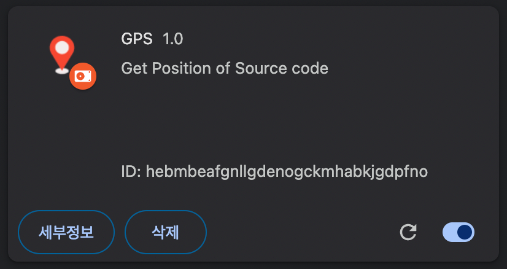

# GPS

- [데모](#데모)
- [사용법](#사용법)
- [설치](#설치)
- [만들 때 참고한 자료](#만들-때-참고한-자료)

React 또는 Vue 프로젝트를 개발하는 개발 환경(development)에서 브라우저에 렌더링된 컴포넌트의 소스코드 경로를 표시하고, 에디터를 열어서 해당 소스코드 위치로 이동합니다.

## 데모

https://github.com/datalater/gps/assets/8105528/0cb84713-2eb0-4ac0-bff1-8a887d768c0a

## 사용법

- **소스코드 경로 보기**: 옵션 키(`⌥` or `Alt`)를 누른 상태에서 DOM 요소에 마우스를 호버합니다.
- **소스코드 경로 이동하기**: 옵션 키를 누른 상태에서 DOM 요소를 클릭합니다.

## 설치

**01 프로젝트를 다운로드합니다.**

```
git clone https://github.com/datalater/gps.git
```

**02 Chrome 브라우저에서 `chrome://extensions/`로 이동합니다.**

**03 `압축해제된 확장 프로그램을 로드합니다.` 버튼을 눌러서 `gps` 디렉토리를 선택합니다.**

> [!NOTE]
>
> 설치에 어려움이 있다면 [공식 가이드](https://developer.chrome.com/docs/extensions/get-started/tutorial/hello-world?hl=ko#load-unpacked)를 참조해주세요.

<details markdown="1">
<summary><strong>설치가 완료된 화면</strong></summary>



</details>

## 만들 때 참고한 자료

크롬 확장 프로그램:

- [Chrome for Developers - 콘텐츠 스크립트](https://developer.chrome.com/docs/extensions/develop/concepts/content-scripts?hl=ko#static-declarative)
- [Chrome for Developers - chrome.scripting](https://developer.chrome.com/docs/extensions/reference/api/scripting?hl=ko#type-ExecutionWorld)
- [GoogleChrome/chrome-extensions-samples: images](https://github.com/GoogleChrome/chrome-extensions-samples/tree/main/functional-samples/tutorial.reading-time/images)

아이콘:

- figma
